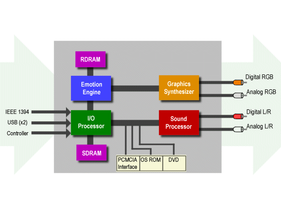

# Sound and Vision: A Technical Overview of the Emotion Engine
[*(original link)*](http://archive.arstechnica.com/reviews/1q00/playstation2/m-ee-1.html)
*by [Jon "Hannibal" Stokes](mailto:hannibal@arstechnica.com)*

### Preface

I'll spare you the obligatory opening fluff paragraph that goes something like "when Sony first announced the Emotion Engine...," and I'll cut right to the chase. The Emotion Engine is weird. It's so weird, in fact, that it took me quite a while to figure out how it works, and as a result, it's going to take me quite a while to explain it. The result of this is that I want to approach this topic in two parts.

The first part of this article will not be as technically granular as most of my previous work because I want to provide a pertinent overview and a context for understanding the Emotion Engine in detail, without addressing some of the more complex architectural issues. For the technically uninitiated, the first part will suffice in bringing you the mojo you need (and hopefully wetting your whistle for more). With the foundation laid in part I, the second part of this article will, then, delve into the depths of the Emotion Engine. This second part is probably less accessible than the first, because to understand it, you'll need to be familiar with CPU architectural concepts like pipelining, VLIW, SIMD, instruction latency, throughput, etc. If you are not familiar with these terms, I'd suggest checking out some of [my previous work](..) [*(original link)*](http://www.arstechnica.com/cpu/index.html). [**Update 10/05/00**: I've since written a [system-level comparison of the PS2 and the PC](../ps2vspc) [*(original link)*](http://www.arstechnica.com/cpu/2q00/ps2/ps2vspc-1.html), which should be a bit more accessible than this article. I'd suggest reading it first.]

Also, a disclaimer before I get started. The literature on the PS2 offers conflicting numbers for the sizes of the various caches in the Emotion Engine. These numbers are usually the last to be fixed at production time, and I'm not sure of the latest ones. However, I used the numbers that I thought were most recent. Feel free to correct me if you know otherwise.

### Part I: General Playstation 2 Overview

The bulk of this article will deal exclusively with design and function of the heart of Sony's [Playstation 2](../..) [*(original link)*](http://www.arstechnica.com/cpu/1q99/playstation2-pr.html): the Emotion Engine. However, because of the way Sony designed the PS2, it's not really possible to look only at the Emotion Engine, and ignore the rest of the system. So we'll start out by looking at the system as a whole, and then we'll narrow the discussion to the Emotion Engine.

We have to look at the Emotion Engine in the context of the overall design of the PS2 because, unlike a modern PC's CPU, the Emotion Engine is not really a general purpose computing device. The CPU of a PC is designed from the ground up to run SPEC benchmarks...er, application code as fast as possible. Since application code comes in a wide variety of forms and performs a wide variety of functions, CPU hardware must be general enough to give acceptable performance on almost anything a coder throws at it. In a PC system, this general-purpose CPU is augmented by special purpose hardware for things like video acceleration, network communications, sound processing, etc..

The PS2 is in a slightly different situation. The PS2's designers had the luxury of designing hardware whose main purpose is to run one type of application extremely well: the 3D game. Sure, the PS2 can run web browsers, mail clients, and other types of software, but that's all secondary. The main thing the PS2 does is 3D gaming, which means generating the kind of immersive sound and vision that places you in a virtual world. Nearly all of the PS2's hardware is dedicated to providing some specific portion of that audiovisual gaming experience.

So just how does the PS2 generate 3D graphics and sound? Let's take a look at the main parts of the PS2.

In the above picture, you can see that there are four main parts to the device. Let's look at the one at a time. The [I/O Processor (IOP)]() [*(original link)*](http://www.arstechnica.com/cpu/1q99/playstation2-io.html) handles all USB, FireWire, and game controller traffic. When you're playing a game on the PS2, the IOP takes your controller input and sends it to the [Emotion Engine]() [*(original link)*](http://www.arstechnica.com/cpu/1q99/playstation2-cpu.html) so that the Emotion Engine can update the state of the game world appropriately. The Emotion Engine is the heart of the PS2, and the part that really makes it unique. The Emotion Engine handles two primary types of calculations and one secondary type:

* **Geometry calculations**: transforms, translations, etc.
* **Behavior/World simulation**: enemy AI, calculating the friction between two objects, calculating the height of a wave on a pond, etc.
* **Misc. functions**: program control, housekeeping, etc.

When all is said and done, the Emotion Engine's job is to produce **display lists** (sequences of rendering commands) to send to the [Graphics Synthesizer]() [*(original link)*](http://www.arstechnica.com/cpu/1q99/playstation2-gfx.html). The Graphics Synth is sort of a souped-up video accelerator. It does all the standard video acceleration functions, and its job is to render the display lists that the EE sends it. Finally, the Sound Processor is the "soundcard" of the PS2. It lets you do 3D digital sound using AC-3 and DTS.

The Emotion Engine is sort of a combination CPU and DSP Processor, whose main function is simulating 3D worlds. So before we discuss the Emotion Engine's architecture in detail, we should talk a bit about DSP (Digital Signal Processing) and 3D graphics.

## Background: 3D rendering and DSP basics

A DSP processor, in a nutshell, takes in massive amounts of input data and performs repetitive, loop-based calculations on it to produce massive amounts of output data. Speed and bandwidth are of the essence in digital signal processing. One of the most useful and important features that modern DSPs have is the ability to do a **MAC** (multiply-accumulate) in a single cycle. A MAC is used in a variety of vector calculations, the most common of these being the **dot product**. The dot product involves summing the products of vector element pairs, and it requires a series of MACs to calculate. The Emotion Engine has a total of **10 FMACs** (Floating-Point Multiply-Accumulators), each of which can do one 32-bit floating-point MAC operation per cycle. If you were wondering what's behind those outrageous polygon counts that Sony publishes for the PS2, now you know; the PS2 can do a lots of MACs, very, very quickly.

The second big requirement for a DSP processor is memory bandwidth and availability. The PS2 is full of small, strategically placed caches (the SPRAM, VU instruction and data memory, etc.) that can be accessed in a single cycle. More importantly, the **SPRAM** (Scratch Pad RAM--more on this in a moment) interleaves those single-cycle CPU accesses with slower memory bus DMA accesses, so the SPRAM doesn't get tied up by the slower main bus. Finally, the Emotion Engine contains a **10-channel DMA controller (DMAC)** to manage up to 10 simultaneous transfers on the Emotion Engine's internal 128-bit, 64-bit, and 16-bit buses. With the DMA controller directing all that bus traffic between the various components and types of memory, the other components are free to do their thang without having to manage data transfers themselves.

The final bit of background info that's pertinent to our project involves 3D rendering. This isn't the place to discuss 3D rendering basics or anything like that (and I'm not really the guy to discuss them either), but there is one aspect of the rendering process we should cover. The Graphics Synthesizer on the PS2 takes data from the Emotion Engine in a very specific form: the **display list**. The display list is a sequence of drawing commands that tells the GS which primitive shapes to draw and where. A typical display list contains commands to draw vertices, shade the faces of polygons, render bitmaps, etc.--basically, the commands required to actually draw the virtual, 3D world of the game. The Graphics Interface unit (GIF) can take multiple display lists from multiple units inside the Emotion Engine and combine them to allow the Graphics Synth to produce composite images. Or, it can arbitrate between the lists to decide which ones get drawn and when.

Since the Graphics Synthesizer eats display lists, the Emotion Engine's main job is to feed those lists to it. The Emotion Engine's various subunits can operate independently of each other in order to asynchronously generate multiple display lists to send to the GS. Since the Graphics Synth's interface unit, the GIF, handles, tracks and manages all of these display lists, Emotion Engine doesn't really have to waste computational resources or internal bus bandwidth keeping track of them. Its various sub-units just concentrate on cranking them out and sending them over a dedicated, 64-bit bus to the GIF. Render 'em all, and let the GIF sort 'em out.

## The Emotion Engine: Basic Architecture

As was stated above, the Emotion Engine's primary piece of output is the display list. Generating those display lists involves a number of steps besides just the obvious geometry calculations. For instance, if the software you're running is a racing game, then you've got to first calculate the virtual friction between a car's tires and the road (among other things) when the car turns a corner before you can draw the next scene. Or if the game is an FPS, you have to run the enemy AI's path-finding code so you'll know where to place them on each frame. So there's a lot of stuff that goes on behind the scenes and affects the output on the screen. All of this labor--geometry calculations, physics calculations, AI, data transfers, etc.-- is divided up among the following units:

* **MIPS III CPU core**
* **Vector Unit** (which is actually two vector units, VU0 and VU1).
* floating-point coprocessor, or FPU
* **Image Processing Unit** (The IPU is basically an MPEG2 decoder with some other capabilities).
* **10-channel DMA controller**
* **Graphics Interface unit**. (GIF)
* **RDRAM interface** and **I/O interface** (for connecting to the two RDRAM banks and the I/O Processor, respectively))

All of the above components are integrated onto one die and are connected (with the exception of the FPU) via a shared 128-bit internal bus.

As was noted in the bullet list, the VU can be further divided into two independent, **128-bit SIMD/VLIW** vector processing units, **VU0** and **VU1**. These units, though they're microarchitecturally identical, are each intended to fill a specific role. Toshiba, who designed the Emotion Engine and licensed it to Sony, didn't feel that it was optimal to have three pieces of general purpose hardware (a CPU and two vector processors) that could be assigned to any task that was needed. Instead, they fixed the roles of the devices in advance, customized the devices to fit those roles, and organized them into logical units. In that respect, they're sort of like employees who've been grouped together on the basis of talent and assigned to teams. Let's look at the division of labor amongst the components:

1. **CPU** + **FPU**: basic program control, housekeeping, etc.
2. **CPU** + **FPU** + **VU0**: behavior and emotion synthesis, physics calculations, etc.
3. **VU1**: simple geometry calculations that produce display lists which are sent directly to the Graphics Synth (via the GIF).
4. **IPU**: image decompression

Of the above "teams," 2 and 3 are the ones I want to talk about here.

### The CPU/FPU/VU0 team

The FPU and VU0 are coprocessors for the MIPS III CPU core. This means that the CPU, the FPU, and VU0 all form a logical and functional unit (or a team, if you will) where the CPU is the primary, controlling device and the other two components extend its functionality. This CPU/FPU/VU0 team has a common set of goals: emotion synthesis, physics, behavior simulation, etc. I'll be going into much more detail on this collaboration in the second half of the article.

There are two main things that bind this team together and allow them to work very closely with each other. The first is the way they communicate with each other: VU0 and the FPU each have a dedicated, 128-bit coprocessor bus that connects them directly to the CPU. That way, they don't have to talk over the main, shared bus. The dedicated 128b bus also gives the CPU direct access to VU0's registers, and allows VU0 to fill its role as a standard, **MIPS III coprocessor**.

The other important component that ties the CPU core and VU0 closely together is the **Scratch Pad RAM**. The SPRAM is 16K of very fast RAM that lives on the CPU, but that both the CPU and VU0 can use to store data structures. The SPRAM also acts as a staging area for data, before it's sent out over the 128b internal bus. So the SPRAM is kind of like a shared workspace, where the CPU and VU0 collaborate on a piece of data before sending it out to wherever it needs to go next.

### The VU1/Graphics Synth team

The other main team is composed of VU1 and the Graphics Synthesizer (which communicate via the GIF). Just as VU0 has a dedicated bus to the CPU core, VU1 has its own 128-bit dedicated path to the GIF. However, VU1 and the Graphics Synth aren't as closely tied together as are the CPU/FPU/VU0 group. VU1 and the GS are more like equal partners, and one doesn't control the other. You're probably wondering at this point just who does control VU1. This is an interesting question, and we'll discuss the answer when we talk about VU1's architecture in detail.

### Putting the teams together

Though the roles of the components were fixed by the PS2's designers, the overall design is still quite flexible. You divvy up an application's work amongst the teams however you like. For instance, the CPU/FPU/VU0 group can generate display lists and do geometry processing in parallel with VU1, so both groups can send display lists to the GIF at the same time.

Or, the CPU/FPU/VU0 group can act as a sort of preprocessor for VU1. The CPU and co. process conditional branches in the rendering code and load data from main memory. They then generate world information that VU1 takes as input and and turns into a display list.

This flexibility allows a developer to customize the process of generating and rendering the 3D environment to suit the needs of the specific application you're working with.

Now that we've gone over the basics of the Emotion Engine's operation, it's time to get hardcore. For the remainder of this article, I'll go in-depth on the MIPS III CPU core, VU0, and VU1. I'll give you the straight scoop on how these components are designed, and how they're integrated with each other. If terms like instruction latency, pipelining, and SIMD make your eyes glaze over, then you might want to check out here. If, however, you're an architecture enthusiast who eats CPU internals for breakfast, then hang on, because what follows is quite fascinating.

## The MIPS III CPU core

The MIPS ISA has been a popular one for everything from game consoles to SGI workstations. Check out [this page]() [*(original link)*](http://www.mips.com/coolApps/s3p3.html) for the rundown on the various products that MIPS has shown up in. Among them are:

* Sony Playstation
* Nintendo 64
* Sony's WebTV
* Cassio's Cassiopeia PDA line.
* Sony's AIBO
* Various printers, copiers, scanners, etc.

In short, the MIPS ISA is an industry standard RISC ISA that's found in applications almost everywhere. Sony's MIPS III implementation is a 2-issue design that supports multimedia instruction set enhancements. It has 32, 128-bit GPRs (general purpose registers), and the following logical pipes:

* Two 64-bit integer ALUs
* a 128-big Load/Store Unit
* a Branch Execution Unit
* FPU Coprocessor (COP1)
* Vector Coprocessor, VU0 (COP2)

(Here's a shot of the processor [block diagram](../diagram1.gif) [*(original link)*](http://www.arstechnica.com/reviews/1q00/playstation2/diagram1.html).) The core can issue two 64-bit integer ops, or one integer op and one 128-bit Load/Store per cycle. For the obsessed, below is a handy chart that gives you a breakdown of all the types of instructions that can be issued concurrently:

--          | ALU | MAC0 | MMI | Branch | COP1 oper. | COP2 oper.
----------- | --- | ---- | --- | ------ | ---------- | ----------
ALU         | X   | X    | X   | X      | X          | X
MAC1        | X   | X    | X   | X      | X          | X
LZC         | X   | X    | X   | X      | X          | X
Ld/St       | X   | X    | X   | X      | X          | X
SYNC        | X   | X    | X   | X      | X          | X
Branch      | X   | X    | X   |        | X          | X
ERET        | X   | X    | X   |        | X          | X
COP0 ld/mov | X   | X    | X   | X      | X          | X
COP1 ld/mov | X   | X    | X   | X      | X          | X
COP2 ld/mov | X   | X    | X   | X      | X          | X

The two, fully-pipelined 64b integer ALU's are interesting, because they can either be used independently of each other (like in a normal CPU), or they can be locked together to do **128-bit integer SIMD** in the following configurations: sixteen, 8-bit ops/cycle; eight, 16-bit ops/cycle; four, 32-bit ops/cycle. Pretty sweet.

To take advantage of the integer and FP SIMD capabilities that COP2 (COP2 = VU0) and the iALUs provide, Toshiba used extensions to the MIPS III ISA that include a comprehensive set of 128-bit SIMD instructions. Here are the instruction types that the CPU core supports:

* MUL/DIV instructions
* 3-op MUL/MADD instructions
* Arithmetic ADD/SUB instructions
* Pack and extend instructions
* Min/Max instructions
* Absolute instructions
* Shift instructions
* Logical instructions
* Compare instructions
* Quadword Load/Store
* Miscellaneous instructions

The CPU has a 16K instruction cache and an 8K data cache, each of which are two-way set associative. It's also capable of speculative execution using a simple, two-part branch prediction mechanism (a 64-entry BTAC and a BHT). Toshiba didn't waste a lot of resources on branch prediction, because the CPU's pipeline is a short 6 stages. Unlike with Willamette's extremely deep 20-stage pipeline, the penalty for a mispredict isn't too high. Here are the pipe stages:

1. PC select
2. Instruction fetch
3. Instruction decode and register read
4. Execute
5. Cache address
6. Writeback

Pretty standard RISC stuff. As usual, the execute stage can take a couple of cycles depending on the latencies of the instructions.

I discussed the SPRAM earlier, but I didn't mention that it has it's own address space that's accessible to the CPU via standard MIPS III Load/Store instructions. These loads and stores are interleaved with the main bus accesses to keep throughput up.

The FPU coprocessor, COP1, doesn't really deserve its own section. It's pretty much a straight-up, floating-point coprocessor that's a throwback to the classic RISC days when the FPU was a separate unit from the core. It executes basic, 32-bit MIPS coprocessor instructions using one FMAC unit and one FDIV unit, each of which is the same as the FMACs and FDIVs in the vector units. I'll talk about what these units do when we get to the vector unit discussion.

As you can tell from the above, the CPU core isn't really all that exciting. The only really cool things in it are the SPRAM and the 128-bit integer SIMD capabilities. Other than that, there's not much out of the ordinary going on. This unit is mostly here to handle program control flow by processing branch commands. It also does other stuff, but it doesn't do any of the *real heavy lifting*--that's reserved for the vector units.

## The Vector Units

Both VU0 and VU1 are *microarchitecturally identical*, but they're not *functionally identical*. VU1 has some extra features tacked onto the outside of it that help it do geometry processing, and VU0 has some features that it doesn't normally use (but that VU1 does). Toshiba did things this way to make the units easier to manufacture. Since VU0 is simpler, we'll start with it first. Just keep in mind that a lot of what's said about VU0 also applies to VU1.

### Vector Unit 0

VU0 is a 128-bit **SIMD/VLIW design**. (If you're confused about the term "SIMD/VLIW," don't worry, so was I at first. We'll discuss what this term means in a special section to follow.) Since VU0 is a coprocessor for the MIPS III core, it spends most of its time operating in **Coprocessor Mode**. This means it looks like just another logical pipe (along with the integer ALUs) to the programmer. The instructions that make VU0 go are just 32-bit MIPS COP instructions, mixed in with integer, FPU, and branch instructions. In this respect, VU0 looks a lot like the G4's Altivec unit. Often, in the rendering process, the CPU maintains a separate thread that controls VU0. The CPU places FP data on the dedicated bus in 128b chunks (w,x,y,z), which the VIF unpacks into 4 x 32 words for processing by the FMACs.

VU0 has its own set of 32, 128-bit FPRs (floating-point registers), each of which can hold 4, 32-bit single precision floating-point numbers. It also has 16, 16-bit integer registers for integer computation.

Here are the computational units available to VU0 (and VU1):

* 4 FMACs
* 1 FDIV
* 1 LSU
* 1 ALU
* 1 random number generator

The first 5 units here, the 4 FMACs and the 1 FDIV, are sort of the heart of both VU0 and VU1 (which are themselves the heart of the Emotion Engine, which is itself the heart of the PS2). So this is where the magic happens. Each of the FMACs can do the following instructions:

--                                 | --
---------------------------------- | -------
Floating-Point Multiply-Accumulate | 1 cycle
Min/Max                            | 1 cycle

The FDIV unit does the following instructions:

--                    | --
--------------------- | ---------
Floating-point Divide | 7 cycles
Square Root           | 7 cycles
Inverse Square Root   | 13 cycles

The bulk of the processing that the PS2 does to make a 3D game involves performing the above operations on lots and lots of data.

Now, those last three units in my list (LSU, ALU, and RNG) aren't normally shown in most charts as being part of VU0. I suspect this is because they aren't used in coprocessor mode. When VU0 is acting like a MIPS Coprocessor, it only uses the 4 FMACs. "Wait a minute," you're saying, "isn't VU0 always a MIPS coprocessor--you know, the 128-bit dedicated bus and stuff? You went to great lengths to make that point in the first half of the article." Yeah, I did kind of insist that VU0 is on the CPU's "team," and that they share the same goals, and that it's bound to the CPU, etc.. This is kind of misleading (although I would argue heuristically justifiable), but all will become clear in the final section. For now, just understand that VU0 mostly operates as a MIPS Coprocessor that handles any FP SIMD instructions that show up in the CPU's instruction stream.

### Vector Unit 1

VU1 is a fully independent SIMD/VLIW processor that includes all the architectural features of VU0, plus some additional mojo. These additions relate directly to VU1's role as a geometry processor for the Graphics Synth, and they help bind it more tightly to the GS. The primary addition is an extra functional unit, the Elemntary Functional Unit (EFU). The EFU is just 1 FMAC and 1 FDIV, just like the CPU's FPU. The EFU performs some of the more basic calculations required for geometry calculation.

Another big difference between VU1 and VU0 is that VU1 has 16K of data memory and 16K of instruction memory (as opposed to VU0's 8K data/8K instruction sizes). This larger amount of data memory is needed because VU1's role as a geometry processor requires that it handle much more data than VU0.

Finally, VU1 has multiple paths it can take to get data to the GIF (and on to the GS). Like VU0, VU1 can send display lists to the GIF via the main, 128b bus. Or, VU1's VIF can send data directly to the GIF. Finally, there's a direct connection between VU1's 16K data memory and the GIF, meaning that VU1 can work on a display list in data memory, and the DMAC can transfer the results directly to the GIF.

I have to pause here and note that there's some serious confusion in Sony's literature on the direct path between VU1 and the GIF. One diagram for a slide show seems to show the path as connecting the instruction memory to the GIF, another diagram quite obviously shows the path going from the lower execution unit to the GIF, and yet another shows it with the path connecting the data memory to the GIF. This last one is the only one that makes sense to me, but I went ahead and left my diagram ambiguous.

As you'll recall from the discussion of VU0, VU0 is controlled by the CPU, and VU0 gets its instructions from whatever program the CPU is currently running. VU1, however, doesn't work that way. VU1's VIF plays a much more prominent role in VU1's life than VU0's VIF does in its. VU1's VIF takes in and parses what Sony confusingly calls a 3D display list. This 3D display list is not VU1's program. Rather, it's a data structure that contains two types of information, and some specialized commands that tell VU1 how to handle this information. The two types of info are

a. the actual VU1 program instructions, which go in VU1's instruction memory.
b. the data that said program operates on. This goes in VU1's data memory.

The VIF decodes and parses the 3D display list commands, and makes sure that VU1 program code and data find their way into the correct spots. In this manner, VU1 can operate independently of the CPU to generate display lists. Executing these VU1, **"VLIW mode"** programs brings into play those three units that VU0 often neglects: the LSU, the iALU, and the RNG. These three units, along with the EFU (which acts as a general FPU), all function to make VU1 a full-blown SIMD/VILW coprocessor. Hahaha...there's that term again: SIMD/VLIW. Now it's time to find out what it means.

## Programming the VU

To wrap up, we're going to take a look at the VU's instruction format, and talk about its microarchitecture in a bit more detail. We'll look at VU1 first, because it always runs in "VLIW mode." Then we'll talk about VU0, and how it's different.

Both VU1 and VU0 are 2-issue, VLIW processors. The basic instruction format for VU1 is a 64-bit, VLIW instruction packet (or "bundle," or whatever VLIW term you want to use) that can be divided into two, 32-bit COP2 instructions.

These two instructions are executed in parallel by two execution units: the upper execution unit and the lower execution unit. (Refer back to the two VU block diagrams on the last page. The upper unit is blue and the lower unit is green.) These two units have the following functionality:

**Upper instructions**:
* 4 parallel FP ADD/SUB
* 4 parallel FP MUL
* 4 parallel FP ADD/MSUB
* 4 parallel MAX/MIN
* Outer product calculation
* Clipping detection

**Lower instructions**:
* FP DIV/SQRT/RSQRT
* Load/Store 128b data
* EFU (1 FMAC + 1 FDIV)
* Jump/Branch
* Random number generator/misc

Now, what you should note is that the upper execution unit is a SIMD unit, while the lower isn't. Hence the term "VLIW/SIMD." So the code is "64-bit VLIW," of which 32 bits are SIMD. Cool, eh? I thought so.

To see this in action, let's look at a code example that I've adapted from one of Sony's slides.

Upper Instruction         | Lower Instruction
------------------------- | ---------------------
`MUL  VF04, VF03, Q`      | `DIV  Q, 1.0, VF02.w`
`MUL  ACC, VF10, VF01.x`  | `MOVE VF03, VF02`
`MADD ACC, VF11, VF01.y`  | `ADD  VI03M VI03, -1`
`MADD ACC, VF12, VF01.z`  | `NOP`
`MADD VF02, VF13, VF01.w` | `LQ   VF01, VI01++`
`NOP`                     | `BGTZ VI03, LOOP`
`NOP`                     | `SQ   VF04, VI02++`

The instructions on the left are executed by the upper execution unit, while the ones on the right are executed by the lower unit.

VU0 is a bit different from VU1 in that, instead of operating in VLIW mode all the time, it normally runs in **"MIPS Coprocessor Mode."** A MIPS Coprocessor instruction is a 32b instruction and not a 64-bit VLIW instruction. So this means that when it's in COP mode, VU0 can crunch 4, 32-bit FP SIMD numbers in parallel, using the 4 FMACs in the upper execution unit. (I'm assuming that in this situation, the upper opcode contains the SIMD FP instruction op and the lower opcode a NOP.)

VU0 doesn't have to stay in COP mode though. It can operate in VLIW mode by calling a micro-subroutine of VLIW code. In this case, it takes a 64-bit instruction bundle and splits it into two 32-bit MIPS COP2 instructions, and executes them in parallel, just like VU1.

As you can see, having two operating modes for VU0 is a bit complex, but it gives the unit a lot of flexibility.

## Summary and conclusions

I hope the above overview has made it clear Sony's Playstation 2 is a force to be reckoned with. Now it's time to tie up some loose ends, and then step back and try to get the big picture. Here's a chart that I ripped and adapted from Sony's literature that gives a rundown of the PS2's main features.

Feature                  | Description
------------------------ | --------------------------------------------------------------
**CPU**                  | MIPS III 2-issue superscalar with 128-bit multimedia extension
*Instruction cache*      | 16K, two-way
*Data cache*             | 16K, two-way
*SPRAM*                  | 16K
**Data Bus**             | 128-bits
**FPU**                  | 1 FMAC + 1 FDIV
**VPU**                  | --
*VPU0*                   | 4 FMACS + 1 FDIV
*VPU1*                   | 4 FMACS + 1 FDIV
*EFU (attached to VPU1)* | 1 FMAC + 1 FDIV
**DMA Controller**       | 10 channels
**IPU**                  | MPEG-2 decoding accelerator

As you can see from the above breakdown, with a total of 10 FMACs, 4 FDIVs, and all the other integer, branch, and load/store resources available, the Emotion Engine is a hoss.

Not only does the Emotion Engine have horsepower under the hood, but its aggressively new, cutting-edge design means that it's going to take a while for developers to really learn to use all that power. It'll be interesting to see if the PC has caught up with the PS2 by the time PS2 developers figure out how to exploit this hardware to its fullest potential.

Although I've stated repeatedly that the PS2's number one application is 3D gaming, neither Sony nor Toshiba (Toshiba designed the Emotion Engine, and Sony licenses it) are going to sit by and let this hardware get pigeonholed in that application space. Sony has invested big, big money (I think it's around $100 million) in developing non-game applications for the PS2. So by the time the PS2 goes stateside, we should see other types of software available for it. This device is going to be the centerpiece of Sony's assault on the world's living rooms, so you can bet they'll milk it for all they can.

Toshiba is also planning to leverage the Emotion Engine in other markets. I don't have any details, but I'd imagine that before too long we can expect to see a whole range of devices based on this chip. As far as its options in the embedded market, it's not exactly the lowest power device available. Here are some specs that should give you an idea how it stacks up, process wise, to other CPUs out there.

--              | --
--------------- | --------------------------
**Clock**       | 250 MHz
**VDD**         | 1.8v
**Design Rule** | 0.25 um
**Gate Length** | 0.18 um
**Power**       | 13 watts
**Transistors** | 10.5 million
**Die size**    | 17 mm x 14.1 mm (240 mm^2)
**Package**     | PBGA (Ball Grid Array)
**Layers**      | 4-layer metal

Just to put things in perspective, 10.5 million transistors is the same number of transistors that the G4 has, with the K7 weighing in at about 22 million transistors. So while the Emotion Engine isn't exactly as svelte as [Crusoe]() [*(original link)*](http://www.arstechnica.com/cpu/1q00/crusoe/crusoe-1.html), it's pretty darn lean considering all the hardware that's packed onto it.

All in all, it should be a fascinating ride in the next few months as MS and Nintendo begin to ready their own console offerings. The PS2 has really upped the ante in terms of raw gaming horsepower, so MS and Nintendo are going to have to offer something killer in response. (Was I the only one who was unimpressed by the recently-released X-Box specs? I hope nVidia packs some amazing hardware into it, because after looking at the Emotion Engine, a 600MHz Intel offering ain't turnin' me on...maybe if it's a Willamette...) All speculation aside though, one thing is definitely for certain. As of the Japanese launch of the Playstation 2 last month, the home entertainment scene just got much, much more exciting.

### Bibliography (and props)

Unfortunately, none of the articles on the PS2 that I used for my research are (legally) available free of charge. I think you can get most of them via the Ask IEEE service on the web though. Speaking of docs, I want to send a big whopping thank you to all the folks who responded to my recent cry for help. I've been poring over the docs in preparation for this article, and I haven't had time to write thank-you's yet. Emails will definitely be forthcoming though, because you guys made this article possible. Now, to the bibliography:

* K. Kutaragi et al., "A Micro Processor with a 128b CPU, 10 Floating-Point MACs, 4 Floating-Point Dividers, and an MPEG2 Decoder," ISSCC (Int’l Solid-State Circuits Conf.) Digest of Tech. Papers,Feb. 1999, pp. 256-257.
* F.M. Raam et al., "A High Bandwidth Superscalar Microprocessor for Multimedia Applications," ISSCC Digest of Technical Papers,Feb. 1999, pp. 258-259.
* A. Kunimatsu et al., *5.5 GFLOPS Vector Units for "Emotion Synthesis"*, (Slide show and presentation.) System ULSI Engineering Laboratory, TOSHIBA Corp. and Sony Computer Entertainment Inc.
* Masaaki Oka Masakazu Suzuoki. *Designing and Programming the Emotion Engine*, Sony Computer Entertainment. IEEE Micro, pp. 20-28
* Various other slides from presentations that people mailed me. I have no idea where they came from, but if there was copyright info on them and I used a diagram from them, I included it.
* Berkeley Design Technology, Inc. *[DSP Processors and Cores -- the Options Multiply]()* [*(original link)*](http://www.bdti.com/articles/multiply.htm). Reprinted from *Integrated System Design*, June, 1995
* Berkeley Design Technology, Inc. [Choosing a DSP Processor]() [*(original link)*](http://www.bdti.com/articles/wpchoose.htm).
