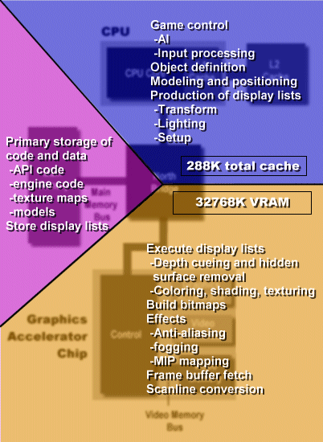

# The Playstation2 vs. the PC: a System-level Comparison of Two 3D Platforms
[*(original link)*](http://archive.arstechnica.com/cpu/2q00/ps2/m-ps2vspc-1.html)
*by [Jon "Hannibal" Stokes](mailto:hannibal@arstechnica.com)*

When I was in the research phase for my recent [technical article on the Emotion Engine](../ee) [*(original link)*](http://www.arstechnica.com/reviews/1q00/playstation2/ee-1.html), I thought for a while there that I was never going to figure out how the PS2 worked. The PS2 is such a bizarre and powerful beast that it took me many hours of poring over articles and slide presentations just to get my bearings with it. Well, it seems I'm not alone in my struggle to understand the capabilities and limitations of one of the most painfully innovative pieces of hardware to hit the consumer market in quite a long time. I got some good feedback from PS2 developers who are also having a hard time with the new hardware. In fact, to get an idea of just how bad the situation is, check out [this article](../../Kent) [*(original link)*](http://www.msnbc.com/news/397313.asp) on MSNBC, which discusses the difficulties that even the most experienced of console programmers are having in learning how to code for the PS2. When the programmers responsible for some of the greatest console games ever made say that the PS2's learning curve is steep, you know something's up.

In this article, I want to try and get a handle on some of the aspects of the PS2 that make it so fundamentally different from the current crop of PCs, and in the process shed some light on the difficulties developers will face in going from the PC to the PS2. Specifically, I'll look at the overall designs of the PS2 and PC, and explain how the demands of dynamic media processing have caused the design of the PS2 architecture to differ from the PC's to the point where developers will have to rethink how they move code and data around to render a 3D environment.

### New wine and old bottles: Dynamic media vs. static applications

To kick off the discussion, I'm going to use a very prescient article published in 1996 by Keith Diefendorff and Pradeep K. Dubey entitled, "How Multimedia Workloads Will Change Processor Design." In this article, Diefendorff and Dubey argue that the processing of dynamic media will result in fundamental changes in processor design, and they detail what some of those changes will look like. In parts, it sounds as if they're looking ahead into the future and describing the PS2. Since this article describes the current situation so well, I'll be drawing on it to frame the discussion.

Diefendorff et al. start out by distinguishing media applications from more traditional applications by noting that media apps are examples of what they call dynamic processing. What this basically means is that the instruction stream doesn't really change all that fast, but the data stream changes constantly. Or, put more concretely, programs like 3D games and scientific applications deal with very large amounts of data, but the groups of instructions that operate on these large data chunks are usually very small. The most common situation is where you have a small loop that iterates through a large matrix or series of matrices many, many times.

Contrast this to a more traditional, static processing application like a word processor, which uses many different segments of code (menus, wizards, spell checkers, etc.) to operate on a single data file (the document). In this type of application, the data stream is pretty stagnant, and doesn't change very much. The instruction stream, however, is all over the map. One minute you're firing up the spell checker to process the file, the next minute you're changing the fonts, and then when that's done, maybe you export it to a different format like Postscript or HTML.

The PC was designed with just such spreadsheets, word processors and other static processing applications in mind. Within recent years, however, it has undergone some significant changes, particularly with the addition of special-purpose hardware like 3D accelerators and sound processors. Such added hardware, however, represents an attempt to put new wine in an old bottle. At some point, Diefendorff and Dubey predict, all media processing functionality will be integrated on a single die, and specialized DSP processing hardware will become obsolete. Furthermore, such designs will feature extremely wide data paths between the on-die components. Enter the PS2...

## Caching, Bandwidth, and 3D rendering

This change in the nature of the instruction and data streams has significant implications for system design. One of the first things to be affected is the cache. Consider the following illustration of caching for a static application.

In the above diagram, you'll notice that there's a steady flow of instructions through the instruction cache, resulting in a high turnover rate. Instructions don't stay in the cache long before getting booted out by the next instruction that the machine needs. The data cache, on the other hand, can collect up the most commonly used pieces of data and just hold onto them while all those instructions in the instruction stream process them. You can just drop a whole piece of data in there, like a spreadsheet or a document, and leave it there while you run a steady stream of instructions over it to modify it. In such a situation, we say that the data exhibits high locality of reference, whereas the instructions exhibit lower locality of reference.

In contrast, a dynamic media app has the opposite cache usage behavior. And in fact, the problem is exacerbated by the fact that a media app pushes data through the data cache much faster than a static app pushes code through the instruction cache.

So while static apps can sometimes make poor use of the instruction cache, media apps almost always make extremely poor use of the data cache. There's just too much data to be processed in too short of an amount of time to be sticking it in a cache and leaving it there. The cache acts as more of a brief stopping-off point for data than as a real cache. However, media apps have excellent locality of reference when it comes to instructions. Most of that data that moves through the cache is processed by loops and other very small bits of code, which are often small enough to fit in the instruction cache and stay there. So the instructions just hang out in the cache and monotonously grind away at all that data that's flying by them.

The other, major difference between static apps and dynamic apps are their bandwidth needs. Since a static app can drop all its instructions and data into a cache without worrying too much about needing to fetch some more anytime soon, systems designed for such applications feature large caches connected by relatively low bandwidth pipes. Dynamic apps, on the other hand, can make do with smaller caches, but since they transfer so much data they need much more bandwidth between them.

Here's a goofy example to help you visualize what I'm talking about: imagine a series of large buckets, connected by pipes to a main tank, with a cow lapping water out of each bucket. Since cows don't drink too fast, the pipes don't have to be too large to keep the buckets full and the cows happy. Now imagine that same setup, except with elephants on the other end instead of cows. The elephants are sucking water out so fast that you've got to do something drastic to keep them happy. One option would be to enlarge the pipes just a little (*cough* AGP *cough*), and stick insanely large buckets on the ends of them (*cough* 64MB GeForce *cough*). You then fill the buckets up to the top every morning, leave the water on all day, and pray to God that the elephants don't get too thirsty. This only works to a certain extent though, because a really thirsty elephant would still end up draining the bucket faster than you can fill it. And what happens when the elephants have kids, and the kids are even thirstier? You're only delaying the inevitable with this solution, because the problem isn't with the buckets, it's with the pipes (assuming an infinite supply of water). A better approach would be to just ditch the buckets altogether and make the pipes really, really large. You'd also want to stick some pans on the ends of the pipes as a place to collect the water before it gets consumed, but the pans don't have to be that big because the water isn't staying in them very long.

## 3D and caching on the PC

The above analogy, silly though it seems, sums up one of the primary differences between the design of the PS2 and that of a PC. 3D games are just the sort of dynamic media apps that the PC wasn't designed to cope with--they're the elephants in the analogy. PC game programmers operate in a world of small pipes and large buckets, and they design games to fit that paradigm. Let's take a look at the architecture of the PC, particularly the caches and connections between them, from a 3D programmer's perspective.

Note that I didn't include the caches on the accelerator's core itself; I only included the VRAM. I did this for a number of reasons. First and foremost, it doesn't really impact our discussion much--you'll see why once we get to the PS2. Second, detailed information on the innards of most 3D chips is kind of hard to come by. Finally, this article is trying to give a more general overview, without getting into to much detail. So just assume that there's cache hanging around inside the accelerator that I'm ignoring.

Let's now go step-by-step through the process of producing a couple of frames of 3D on the above, non-hardware T&L PC system. We'll assume that the application code and the data all fit in main memory.

### Geometry Stage

The first stage of the process is called the geometry stage. This is where a description of the object and its position in the 3D world are created. This description, called a display list, is a sequence of commands, parameters, and other data that can be further processed by the next stage. In order to create the display list, the CPU has to first get the 3D engine code and the data out of main memory and load it into the L1 and L2 caches to be worked on. So the L1 and L2 caches act as sort of a workspace where the CPU can keep code and data in order to do tessellation, setup, transformation, and lighting. These display lists eventually get written back out to main memory before going on to the next stage. In the geometry stage, the FSB and the main memory bus see the most traffic, because all that data is being shuffled back and forth between the CPU caches and RAM.

### Rendering Stage

While the geometry stage is producing one frame, the rendering stage is producing the bitmap of the next frame. This bitmap is a 2D, pixel-by-pixel representation of the 3D scene, which will eventually be drawn on the screen as a frame. The actual rendering of the 2D bitmap from the 3D scene is handled by the video card, so this means that the display lists produced by the CPU have to make their way out of main memory, across the AGP bus, and into the video card's video memory. Here, the vid card builds the bitmaps in the frame buffers by executing the display lists. The display lists tell the vid card to draw triangles and lines, do coloring and shading, apply texture maps, etc. The application of texture maps means moving the textures out of main memory and into the video memory, which even further stresses the AGP and main memory buses.

### Display Stage

Finally, in the display stage, the next frame is being painted onto the screen. This painting involves fetching data from the frame buffer and converting that digital pixel data into a stream of analog signals that the monitor can understand. This stage makes heavy use of the video memory and the video memory bus.

You should be able to tell from the above, very general description just how closely the 3D rendering process is fitted to the PC's architecture. To further nuance the description, let's look at the overall division of labor for the rendering process on a standard PC. First up, here's a table that gives you a very general idea of how much cache is available to the rendering pipeline.

Pentium III, 32MB TNT2 Ultra |
---------------------------- | --------------------
L1 cache (instruction, data) | 16K 4-way, 16K 4-way
L2 cache                     | 256K unified
Video Memory                 | 32MB
Total                        | 33,056K

Now let's see how that cache is divided up geographically and functionally.

As we'll soon see, the above division of labor doesn't quite work for the PS2. In fact, that's a major understatement, so let me rephrase: it doesn't work at all. The PS2 requires you to rethink how you divide up the labor between the stages of the rendering pipeline, and how you move code and data around between those stages.

## Caching on the PS2

First, let's take a look at the PS2's bus and cache layout.

What I've tried to represent in the above figure is that the caches are much smaller than those on the PC, but the buses connecting them are much wider. Again, I'm sure that if I had access to the details of the Graphics Synth's architecture, I'd almost certainly find that it has cache inside of it, too, in various places.

In place of the PC's north bridge, the PS2 has a 10-channel **Direct Memory Access Controller (DMAC)** that coordinates data transfers between the units and caches on the Emotion Engine's 128-bit and 64-bit internal data paths. The PS2 also uses two, 128MB RDRAM banks for its main memory, each of which is connected to the EE's on-die DMAC by a high-speed 16-bit bus. RDRAM has the virtue of being an extremely high-bandwidth memory solution, so it can keep that 10-channel DMAC (which can manage 10 simultaneous bus transfers) busy and those internal caches fed.

Speaking of the PS2's internal caches, let's look at their sizes, and how they stack up to a PIII's caches, especially with respect to the first few stages of the rendering pipeline.

Playstation2                   |
------------------------------ | ------------------------------------
L1 cache (instruction,data)    | 16K 2-way instruction, 8K 2-way data
SPRAM                          | 16K
VU0 cache (instruction + data) | 16K + 16K = 32K
VU1 cache (instruction + data) | 16K + 16K = 32K
Video memory                   | 4MB
Total                          | 4,200K

As you can tell from the above chart, the PIII system outlined earlier has almost 8 times the amount of cache in its rendering pipeline than the PS2 does. Even if we take the video memory and the cache on the accelerator card completely out of the equation, the PC still has about 3 times the cache of the PS2. Furthermore, what little cache the PS2 has is divided up among a larger number of small caches. Remember the zoo analogy: large buckets and small pipes vs. small pans and large pipes.

The PS2's approach is causing developers to rethink how they move data inside the machine. In a comment in the /. thread about my PS2 article, one ex-PS2 developer noted that the VU caches are too small to store a whole model or 32-bit texture, so programmers were pulling their hair out trying to figure out how to deal with the size limitation. He pointed out that one group that had had PS2 development units for a while took the strategy of constantly downloading textures and models into the VU and processors, instead of downloading them once, caching them, and working on them inside the cache. This approach was running the 10-channel DMAC at 90% capacity! This kind of aggressive use of bandwidth resources is exactly the kind of thing PS2 developers will have to do. Between the RAMBUS memory banks, the 10-channel DMAC and the 128-bit internal data bus, the PS2 has bandwidth to burn--what it doesn't have is internal cache. Currently, developers are thinking in terms of 3D cards with large on-board memory that can cache large models and textures, and modestly sized L1 and L2 caches for storing code and data.

The PS2 is the exact opposite, though. There's memory-to-processor bandwidth out the wazoo. The RIMMS are the cache, and the available bandwidth is such that you can get away with storing everything there and downloading it on the fly. So with the PS2, code and data have to be constantly streamed over the wide internal buses in order arrive at the functional units right when they're needed. Of course, then the trick is scheduling the memory transfers so that you always have what you need on hand and latency doesn't kill you. I'm not so sure how developers will tackle this, but it'll be interesting to see what techniques they'll use. I'm sure the PS2 has some sophisticated prefetching hardware that's not discussed in any of the documentation I have.

## SIMD on the PS2

Diefendorff and Dubey point out one more important way that dynamic media processing will affect system design. They note:

> Input data streams are frequently large collections of small data elements such as pixels, vertices, or frequency/amplitude values. The parallelism in these streams is fine grained. And because elements of these large input data streams tend to undergo identical processing (filtering, transformations, and so on), it lends itself to machines with SIMD hardware units operating in parallel…for media processing, simple SIMD execution units with wide data paths would be able to achieve significant speedups without this enormous complexity. (p.2)

What they're saying is that media applications exhibit a very high degree of data parallelism, much more so than static apps. Static applications, on the other hand, exhibit varying degrees of instruction-level parallelism, but little data parallelism. Here's a diagram that shows a static application at work.

In contrast, dynamic media processing exhibits very little instruction-level parallelism and massive amounts of data parallelism. What instruction stream parallelism a dynamic app does have usually happens at the thread level, and not at the individual instruction level. As a result, such apps lend themselves to [SIMD processing](../simd) [*(original link)*](http://www.arstechnica.com/cpu/1q00/simd/simd-1.html).

The PS2 has two dedicated 128-bit SIMD floating-point vector units, VU0 and VU1, each of which are able to process massive amounts of data per clock cycle. In addition, the MIPS III CPU core on the Emotion Engine can do 128-bit integer SIMD by locking together its two 64-bit integer pipes. So the PS2 fits the profile of having multiple parallel SIMD units connected by high-bandwidth pipes.

Again, the issue is how to make use of these resources. PC programmers aren't used to having access to that kind of raw, data processing power. In fact, from what I've heard, very few developers are using both vector units.

We're beginning to see vector processing take off on the PC, and I have no doubt that it will be very prevalent in the next few years. However, until the PC is able to overcome its bandwidth bottlenecks it won't be able to keep its SIMD units fed as well as the PS2.

## Conclusions

So which machine is more powerful? Well, if you're talking 3D gaming and you mean right now, I wouldn't hesitate to give the crown to the PS2. Looking ahead to the next two or three years, the future looks much less certain. It'll be quite a while before developers are able to figure out how to harness the full capabilities of the PS2, and while they're scratching their heads the PC will be getting more and more powerful. As we'll soon see with the NV15, the PC is still advancing quickly under the old "large buckets and slightly bigger pipes" paradigm. However, the PS2 represents the true next generation of media processing, and until the PC catches up with it in terms of bandwidth and overall data throughput (read "SIMD") it can't be worthily called a true dynamic media machine. That being said, a look at the PS2 is a look into the (probably near) future of the PC. The data pipes will indeed get wider, SIMD will increase the amount of media data a PC can process, and the PC will resemble more and more the kind of media machine that Diefendorff and Duby described, and that the engineers at Sony and Mitsubishi built.

## Bibliography

* Keith Diefendorff and Pradeep K. Dubey, "How Multimedia Workloads Will Change Processor Design." Computer, September 1997
* Stephen P. VanderWiel and David J. Lija. "When Caches Aren't Enough: Data Prefetching Techniques." *Computer*
* Bruce Shriver, Bennett Smith. *The Anatomy of a High-Performance Microprocessor: A Systems Perspective*. Los Alamitos, CA: IEEE Computing Society Press, 1998
* [Sound and Vision: A Technical Overview of the Emotion Engine](../ee) [*(original link)*](http://arstechnica.com/reviews/1q00/playstation2/ee-1.html), Jon Stokes.
