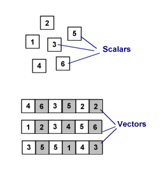
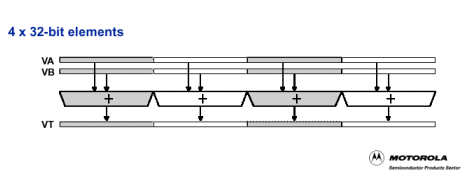
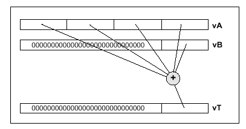
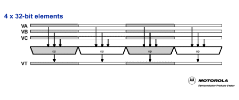
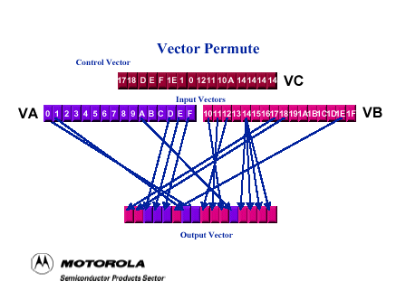
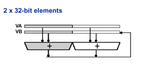
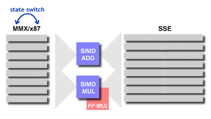
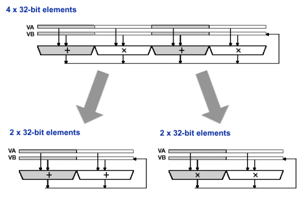
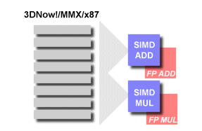
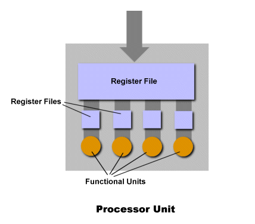

# 3 1/2 SIMD Architectures
[*(original link)*](http://archive.arstechnica.com/cpu/1q00/simd/m-simd-1.html)
*by [Jon "Hannibal" Stokes](mailto:hannibal@arstechnica.com)*

What do Sony's Playstation2 and Motorola's MPC7400 (a.k.a. the G4) have in common? Besides the incredible hype behind both products and their legions of crazed fans, there's one acronym that unites them all--an acronym that sums up the secret to their stellar performance: SIMD. Single Instruction stream, Multiple Data streams (SIMD) computing first entered the personal computing world in the form of Intel's neglected addition to the x86 instruction set, MMX. Even though MMX was panned by the press and was slow to be adopted, SIMD computing was here to stay on the personal computing landscape. And it's a good thing too, because SIMD is a technology whose time has definitely come, and it's just about ubiquitous on the desktop: MMX, SSE, 3DNow!, AltiVec, etc. are all acronyms for SIMD instruction sets. In this article, we're going to look at what SIMD is, what it offers, and how it's integrated in three-and-a-half of today's hottest processors. Three and a half? The half is Sun's upcoming [MAJC architecture](../majc) [*(original link)*](http://archive.arstechnica.com/cpu/4q99/majc/majc-1.html), which isn't actually out yet. We've included it here because its approach to SIMD is quite different from the other three, so it provides a nice contrast.

This article will provide a basic introduction to SIMD concepts, as well as an overview of the three and a half SIMD implementations under discussion. One thing that should definitely be understood is that this article is actually the sequel to my previous [G4 vs. K7]() [*(original link)*](http://archive.arstechnica.com/cpu/1q00/g4vsk7/g4vsk7-1.html) tech article. If you want to look at AltiVec and 3DNow! in the context of both the G4 and K7 as a whole, then you must read the first article too. This article focuses in on the SIMD, and ignores many of the important issues already taken up by its predecessor.

### SIMD basics

Early microprocessors didn't actually have any floating-point capabilities; they were strictly integer crunchers. Floating-point calculations were done on separate, dedicated hardware, usually in the form of a math coprocessor. Before long though, transistor sizes shrunk to the point where it became feasible to put a floating-point unit directly onto the main CPU die, and the modern integer/floating-point microprocessor was born. Of course, the addition of floating-point *hardware* meant the addition of floating-point *instructions*. For the x86 world, this meant the introduction of the x87 floating-point architecture and its (now hopelessly archaic) stack-based register model.

So the x87 brought a new name, new capabilities, new registers, and new instructions to Intel's microprocessors. Sound familiar? It should.

Actually, the addition of SIMD instructions and hardware to a modern, superscalar CPU is a bit more drastic than the addition of floating-point capability. A microprocessor is a SISD device (Single Instruction stream, Single Data stream), and it has been since its inception.

As you can see from the above picture, a SIMD machine exploits a property of the data stream called **data parallelism**. You get data parallelism when you have a large mass of data of a uniform type that needs the same instruction performed on it. A classic example of data parallelism is inverting an RGB picture to produce its negative. You have to iterate through an array of uniform integer values (pixels), and perform the same operation (inversion) on each one -- multiple data points, a single operation. Modern, superscalar SISD machines exploit a property of the instruction stream called **instruction-level parallelism** (ILP). In a nutshell, this means that you execute multiple instructions at once on the same data stream. (See [my other articles](..) [*(original link)*](http://archive.arstechnica.com/cpu/index.html) for more detailed [discussions of ILP](../majc) [*(original link)*](http://arstechnica.com/cpu/4q99/majc/majc-2.html)). So a SIMD machine is a different class of machine than a normal microprocessor. SIMD is about exploiting parallelism in the data stream, while superscalar SISD is about exploiting parallelism in the instruction stream.

There were some early, ill-fated attempts at making a purely SIMD machine (i.e., a SIMD-only machine). The problem with these attempts is that the SIMD model is simply not flexible enough to accoodate general purpose code. The only form in which SIMD is really feasible is as a part of a SISD host machine that can execute conditional instructions and other types of code that SIMD doesn't handle well. This is, in fact, the situation with SIMD in today's market. Programs are written for a SISD machine, and include in their code SIMD instructions.

One thing I'd like to note for the sake of all you nit-pickers out there, is that I'm going by the description of SISD as laid out in [Hennessey and Patterson]() [*(original link)*](http://archive.arstechnica.com/etc/books/comp-arc.html). A more detailed discussion of the finer points of SISD vs. SIMD as concepts, while it would be appropriate here, would hinder us from moving more quickly to the actual comparison of the SIMD implementations.

## SIMD operations

The basic unit of SIMD love is the vector, which is why SIMD computing is also known as vector processing. A vector is nothing more than a row of individual numbers, or scalars.

A regular CPU operates on scalars, one at a time. (A superscalar CPU operates on multiple scalars at once, but it performs a different operation on each instruction.) A vector processor, on the other hand, lines up a whole row of these scalars, all of the same type, and operates on them as a unit.

These vectors are represented in what is called **packed data format**. Data are grouped into bytes (8 bits) or words (16 bits), and packed into a vector to be operated on. One of the biggest issues in designing a SIMD implementation is how many data elements will it be able to operate on in parallel. If you want to do single-precision (32-bit) floating-point calculations in parallel, then you can use a 4-element, 128-bit vector to do four-way single-precision floating-point, or you can use a 2-element 64-bit vector to do two-way SP FP. So the length of the individual vectors dictates how many elements of what type of data you can work with.

Motorola's AltiVec literature divides into four useful and easily comprehendible categories the types of SIMD operations that AltiVec can do. These categories are a good way of dividing up the basic things you can do with vectors. Unfortunately for people who write SIMD comparison articles, both AMD's and Intel's tech docs categorize their hardware's SIMD operations in a completely different and less accessible way. (Actually, Intel's tech docs categorize things one way, and AMD's tech docs copy Intel's categorization. It's good to see that at least Motorola can think differently.) I'm going to use Motorola's categories, at least initially, for tutorial purposes. I'm also going to rob some of Motorola's pictures out of their AltiVec literature, and modify them a bit.

### I. Intra element arithmetic and non-arithmetic functions.

Intra-element arithmetic is one of the most basic and obvious types of SIMD operation. Consider an intra-element addition. This involves lining up two vectors (VA and VB), and adding their individual elements together to produce a sum vector (VT). The above picture shows an example of inter-element arithmetic at work. Inter-element operations also include multiplication, multiply-add, average, and min.

Intra-element non-arithmetic functions basically work the same as above, except for the fact the operations performed are different. Intra-element non-arithmetic operations include AND, OR, and XOR.

Vector intra element instructions:
* integer instructions
* integer arithmetic instructions
* integer compare instructions
* integer rotate and shift instructions
* floating-point instructions
* floating-point arithmetic instructions
* floating-point rounding and conversion instructions
* floating-point compare instruction
* floating-point estimate instructions
* memory access instructions

### II. Inter Element Arithmetic

Inter-element operations are operations that happen between the elements in a single vector. An example of an inter-element arithmetic operation is shown above. This operation sums across the elements in a vector, and stores the result in an accumulation vector.

### IV. Inter Element Non-arithmetic

Inter-element non-arithmetic operations are operations like vector permute, which rearrange the order of the elements in an individual vector. We'll look at the permute operation a little closer in a later section.

Vector inter element instructions:
* alignment support instructions
* permutation and formatting instructions
* pack instructions
* unpack instructions
* merge instructions
* splat instructions
* permute instructions
* shift left/right instructions

## Saturated Arithmetic

One feature that all the SIMD implementations under discussion share is support for saturated arithmetic. With wrap-around arithmetic, whenever you do a calculation whose result turns out to be bigger than what you can represent with whatever data format you're using (16-bit, 32-bit, etc.), the CPU stores a wrap-around number in the destination register and sets some sort of overflow flag to tell the program that the value exceeded its limits. This isn't really ideal for media applications though. If you add two 32-bit color pixel values together and get a number that's greater than what you can represent with 32-bits, you just want the result to come out as the maximum represent able value (#FFFFFF, or white). You don't really care that the number was too big; you just want to represent the extreme value. It's sort of like turning up the volume on an amplifier past 10 (Spinal Tap jokes aside). You can keep on turning that knob, but the amp is already maxed out--which is what you want.

### AltiVec

I'll start my description of SIMD implementations with AltiVec, because of its simplicity and straightforward design. Even though Intel's and AMD's SIMD implementations came before AltiVec chronologically, I'll use AltiVec as the norm and treat the other two as deviations. I do this mainly for didactic purposes; it makes the material easier to understand.

Unlike AMD and Intel, Motorola took a dedicated hardware approach to SIMD. They added 32 new AltiVec registers to the G4's die along with two dedicated AltiVec SIMD functional units, thus increasing the die size of the G4. Nevertheless, the G4's die is still under 1/3 the size of the PIII's, which is itself about half the size of the Athlon's. Since the G3 was so small to begin with (in comparison to Intel's and AMD's offerings), Motorola could afford to spend the extra transistors adding dedicated SIMD hardware.

All of the AltiVec calculations are done by one of two fully-pipelined, independent AltiVec execution units. The first unit is the Vector Permute Unit. It handles vector operations that involve rearranging the order of the elements in a vector. These are those inter-element operations, like pack, unpack, and permute. It also handles vector memory accesses -- the loading and storing of vectors into the registers.

The second piece of hardware is the Vector ALU. This unit handles all of the vector arithmetic (integer and FP multiply, add, etc.) and logic (AND, OR, XOR, etc.) operations. Most of these fall under the heading of intra-element operations, where you're combining two vectors (and possibly a control vector) to get a result.

Both of these execution units are fully pipelined and independent. This means that the G4 can execute two 128-bit vector operations per cycle (one ALU, one permute), and it can do so in parallel with regular floating-point operations and integer operations. The units are also pretty fast. The instruction latency is 1 cycle for simple operations, and 3-4 cycles for more complex ones.

As I noted above, AltiVec has 32 architectural SIMD registers. This is a lot of registers, and they really give the compiler freedom to schedule operations and manage register usage for maximum efficiency. Each register is 128 bits wide, which means that AltiVec can operate on vectors that are 128 bits wide. AltiVec's 128-bit wide vectors can be subdivided into

* 16 elements, where each element is either an 8-bit signed or unsigned integer, or an 8-bit character.
* 8 elements, where each element is a 16-bit signed or unsigned integer
* 4 elements, where each element is a either a 32-bit signed or unsigned integer, or a single precision (32-bit) IEEE floating-point number.

That last bullet point is especially important to note. The ability to grind through vectors of four, single precision floating-point numbers every cycle is impressive, and represents a key advantage of AltiVec.

### Instructions

AltiVec adds 162 new instructions to the G4's instruction set. The AltiVec instruction format is especially nice, as it allows you to use 4 distinct registers to do your computations: two source registers to hold the operands, 1 filter/modifier register, and 1 destination register to hold the result.

The diagram above shows a basic, intra-element operation. VA and VB are the source registers, and VC is a filter/modifier register that can hold masks, or otherwise modify a computation. VT is the destination register.

The filter/mod register adds a lot of flexibility, especially when you're doing something like a vector permute.

In the picture above, VA and VB contain the two vectors to be permuted, and VC contains the control vector that tells AltiVec which elements it should put where.

### Interrupts

Another important advantage of AltiVec that deserves to be pointed out is that there are no interrupts except on vector LOADs and STOREs. You have to have interrupts for LOADs and STOREs in case of, for instance, a cache miss. If AltiVec tries to LOAD some data from the L1 cache into a register, and that data isn't there, it throws an interrupt (stops executing) so that it can wait for the data to arrive.

AltiVec doesn't, however, have interrupts for things like overflows and such (remember the saturated arithmetic discussion). Furthermore, the peculiar implementation that 3DNow! and SSE use to do 128-bit single-precision FP means that a 128-bit fp calculation can throw an interrupt, saturation or no. More on that when we talk about SSE, though.

The upshot of all this is that AltiVec can keep up its single-cycle throughput as long as the L1 keeps the data stream full. The FP and integer instructions aren't going to hold up execution by throwing an interrupt.

## MMX

The story of MMX and SSE/KNI/MMX2 is quite a bit more complicated than AltiVec's. There are a number of reasons why this is so. To begin with, Intel introduced MMX first as an integer-only SIMD solution. MMX doesn't support floating-point arithmetic at all. Even as MMX was being rolled out, Intel knew that they had to include FP support at some point. An article in [an issue]() [*(original link)*](http://developer.intel.com/technology/itj/q21999.htm) of the Intel Technology Journal tells this story:

> In February 1996, the product definition team at Intel presented Intel's executive staff with a proposal for a single-instruction-multiple-data (SIMD) floating point model as an extension to IA-32 architecture. In other words, the "Katmai" processor, later to be externally named the Pentium III processor, was being proposed. The meeting was inconclusive. At that time, the Pentium® processor with MMX instructions had not been introduced and hence was unproven in the market. Here the executive staff were being asked essentially to "double down" their bets on MMX instructions and then on SIMD floating point extensions. Intel's executive staff gave the product team additional questions to answer and two weeks later, still in February 1996, they gave the OK for the "Katmai" processor project. During the later definition phase, the technology focus was refined beyond 3D to include other application areas such as audio, video, speech recognition and even server application performance. In Febuary 1999, the Pentium III processor was introduced.

Another complicating factor for MMX is the fact that Intel jumped through some hoops to avoid adding a new processor state, hoops that complicated the implementation of MMX. I'll deal with this in more detail shortly.

Instead of discussing MMX and SSE together, I'll first discuss MMX alone. This will lay the groundwork for the discussion of both SSE and 3DNow!, since they're both expansions of MMX, and competitors to boot.

### The elements

I'll save a discussion of MMX's implementation on the PIII and its attendant problems for the section on SSE. For now, let's consider some basic features of MMX as an instruction set. Where AltiVec's vectors are 128 bits wide, MMX's are only 64 bits wide. These 64-bit vectors can be subdivided into

* 8 elements (a packed byte), where each element is a 8-bit integer,
* 4 elements (a packed word), where each element is a 16-bit signed or unsigned integer, or
* 2 elements (packed double word), where each element is a 32-bit signed or unsigned integer.

These vectors are stored in 8 MMX registers, based on a flat file model. These 8 registers, MM0-MM7, are aliased onto the x87's stack-based floating-point registers, FP0-FP7. Intel did this in order to avoid imposing a costly state switch any time you want to use MMX instructions. The drawback to this approach is that floating-point operations and MMX operations must share a register space, so a programmer can't mix floating-point and MMX instructions in the same routine. Of course, since there's no mode bit for MMX or FP, there's nothing to prevent a programmer from pulling such a stunt and corrupting his floating-point data.

The fact that you can't mix floating-point and MMX instructions normally isn't a problem, though. In most programs, floating-point calculations are used for generating data, while SIMD calculations are used for displaying it.

In all, MMX added 57 new instructions to the x86 ISA. The MMX instruction format is pretty much like the conventional x86 instruction format:

**MMX Instruction mmreg1, mmreg2**

In the above instruction, mmreg1 is the both the destination and source operand, meaning that mmreg1 gets overwritten by the result of the calculation.

For obvious reasons, this situation isn't nearly as optimal as AltiVec's. If you perform an MMX op and then immediately afterwards need one of the source vectors again, you're SOL. Either you made a backup copy of it in another register beforehand, or you've got to reload it; both options take extra time and hinder performance.

Another thing that makes the MMX instruction format less cool is that MMX operations lack that third filter/mod vector that AltiVec has. This means that you just can't do those once-cycle, arbitrary two-vector permutes. Oh well...

## SSE/MMX2/KNI

If you thought that MMX was hobbled by backwards compatibility issues, wait until you get a load of SSE (the ISA extension formerly known as MMX2/KNI). Intel's goal with SSE was to add four-way, 128-bit SIMD single-precision floating-point computation to the x86 ISA. Did they succeed? Well, sorta.

With the PIII, Intel went halfway on adding dedicated hardware to the CPU die. The PIII has two, fully-pipelined, independent, SIMD, single-precision floating-point units (that's a mouthful). However, for SIMD floating-point multiplication, they expanded on the existing FP multiplier hardware. So SIMD FP multiplications share an execution unit with regular FP multiplications. The PIII does, in fact, have a dedicated SIMD FP adder, which is independent of the regular floating-point hardware.

As far as the registers, Intel went ahead and added an extra 8, 128-bit registers for holding SIMD floating-point instructions. These eight are in addition to the 8 MMX/x87 registers that were already there. Since these registers are totally new and independent, Intel had to hold their nose and add an extra processor state to accommodate them. This means a state switch if you want to go from using x87 to MMX or SSE. It also means that OS code had to be rewritten to accommodate the new state.

Now, when I said that Intel "sorta" succeeded in adding four-way, 128-bit SIMD FP to the x86 ISA, I meant that the way the PIII handles it is kind of a hack. See, a 4-way FP SSE instruction gets broken down into two, 2-way (64-bit) microinstructions. These instructions are then executed either in parallel or sequentially by the two SIMD units. "Wait a minute," you object. "Doesn't one SIMD unit do addition and the other do multiplication?" Yeah, that's the case. So what this means for sustained 128-bit computation with 1 op/cycle throughput is that you can only do it with floating-point multiply-add instructions. These instructions show up in dot product calculations, so they're pretty common. Still, it's not as cool as being able to do just any 128-bit vector calculation you like at 1 op/cycle.

Intel made this decision for a number of reasons. First and foremost, they wanted to conserve die space. As it is, MMX/SSE adds 10% to the size of the PIII's die. If they had gone ahead and implemented an independent SIMD multiplication unit, this percentage would have been higher. So they reused some FP hardware to keep the transistor count low. Furthermore, doing things this way allows them to use the existing 64-bit data paths inside the CPU to do 128-bit computation. Adding dedicated SIMD floating-point hardware and a 128-bit internal data path to push vectors down would have really eaten up transistor resources. Intel was also able to limit the changes to the PIII's instruction decoder by implementing 128-bit SIMD FP in this manner. Finally, the fact that the SIMD adder and multiplier are independent and on two different ports, the PIII can dispatch a 64-bit add and a 64-bit multiply at the same time.

Remember that all of this 128-bit talk applies only to floating-point instructions. Old-school integer MMX calculations are still restricted to the world of 64-bits. Such is the price of backwards compatibility.

### Interrupts

By breaking up the 128-bit ops into two 64-bit uops ("uop" = microinstruction) and running them either concurrently or sequentially, the PIII opens itself up to the possibility that one of the uops will encounter a snag and have to bail out ("throw an exception") after the other one has already been retired. If this were to happen, then only half of the 128-bit destination register would hold a valid result. Ooops.

To prevent this, the PIII includes special hardware in the form of a Check Next Micro-Operation (CNU) mechanism. What this hardware does is keep the first uop from retiring if the second one throws an exception. This means that once the re-order buffer (he keeps track of execution and retirement) gets the first, completed uop of a 128-bit instruction, it has to wait up for the second uop to finish before it can retire them both. This has the potential to slow things down.

Intel got around this by taking advantage of a common case in multimedia processing. Often, as in the case of saturated arithmetic, exceptions like overflow and underflow are masked, which means that the programmer has told the processor to just ignore them. If an MMX or SSE instruction has its interrupts masked, then since the PIII would ignore the exception anyway it just doesn't bother having the re-order buffer (ROB) wait up for the second uop. In this case then, the ROB can go ahead and retire each uop individually. This is much faster, and since it's the common case it reduces the impact of exception handling on performance.

### 3DNow! and Advanced 3DNow!

AMD's 3DNow!, as it's implemented on the Athlon, faces problems similar to those faced by SSE. Since 3DNow!, like SSE, incorporates MMX in all its 64-bit, x87 register-sharing glory, it has to deal with all the less desirable features of MMX (only 64-bit integer computation, the two-operand instruction format, etc.). 3DNow! takes the 57 MMX instructions and adds to them 21 unique instructions that handle floating-point arithmetic, for a total of 78 instructions. The Athlon's Advanced 3DNow! adds another 24 new, SSE-like instructions (for DSP, cache hinting, etc.), bringing the SIMD instruction count up to 114.

3DNow! simulates four-way single precision (128-bit) FP computation the same way that the PIII does, by breaking 4-way instructions down into a pair of 2-way microinstructions, and executing them in parallel on two different SIMD execution units. Like the PIII, the two units are independent of each other, and one does addition and the other multiplication. This means that for 3DNow! to be able to do sustained 128-bit computation, it has to either issue a 2-way single precision multiply and a 2-way single precision add in parallel. However, unlike either the PIII or Altivec, 3DNow has no 128-bit instructions. So any "128-bit SIMD computation" that it does is purely the result of using two 64-bit instructions in parallel. Another big difference between the Athlon's SIMD implementation and the PIII's is that the Athlon has two, independent, fully-pipelined floating-point functional units, and both of them do double duty as SIMD FUs. (Recall that the PIII has two FPUs that aren't fully pipelined, and only one of them does double duty as a SIMD FU.)

The final important difference between SSE and 3DNow! is the fact that all the 3DNow! operations, bother integer and floating-point, share the same 8 registers with MMX and x87 operations. There are no added registers, like on the PIII. This is good and bad. It's good in that you can switch between 3DNow! and MMX instructions without a costly change of state. It's bad insofar as that's very few registers for the compiler to be working with. (The Athlon has a load of internal, microarchitectural 3DNow!/MMX/FP registers, so it can use register renaming to help alleviate some of the register starvation. The PIII also has microarchitectural rename registers for this purpose, but the Athlon has more of them.)

## MAJC

I want to touch very briefly on Sun's upcoming MAJC architecture, because it handles SIMD in a completely different way than any of the above CPUs. Sun didn't take an existing CPU design and add SIMD capabilities to it in the form of a dedicated SIMD unit. What they did instead was integrate SIMD support seamlessly into the design of the processor itself.

If your read my [article on Sun's MAJC](../majc) [*(original link)*](http://archive.arstechnica.com/cpu/4q99/majc/majc-1.html), then you're familiar with the fact that it's a 4-wide VLIW processor. The cool thing about MAJC is that all four of its functional units are data-type agnostic. There are no integer units or floating-point units. (More technically, there are no integer or fp logical pipes, but there is, in fact dedicated hardware at the end of each pipe.) Any FU can handle any type of data, which makes for a number of interesting possibilities. (According to Sun's docs, one of the FUs is an "extended subset" of the other three. So they're not all totally identical, but nearly so.) One of the things you can do with this is feed the same instruction stream to each FU, while feeding four different data streams to each one to do 4-way, 128-bit SIMD integer or floating-point SIMD!

Sun has already stated that this is how they'll do SIMD with MAJC. I'll be interested to see some more details on the types of instructions that they'll implement.

### Conclusions

There is so much more that can be said about these three SIMD implementations. It would be nice to be able to include a detailed breakdown/comparison of the instructions each one offers, in order to get a more nuanced understanding of the functionality each affords. Also, I haven't even talked much about instruction latencies or throughput for any of these architectures; both of these factors greatly impact performance. Finally, each instruction set includes special instructions for manipulating the data stream, manipulating the cache hierarchy, loading and storing vectors, etc. Including these factors in the discussion would almost double the length of this article! A follow-up that deals more in-depth with these critical issues is in order.

Nevertheless, this overview has covered some of the basic SIMD concepts and implementation issues relevant for current personal computing market. Also, as I said at the outset, this article is meant to be read in conjunction with my [previous architectural comparison]() [*(original link)*](http://archive.arstechnica.com/cpu/1q00/g4vsk7/g4vsk7-1.html). Right now, I think it's clear that AltiVec's SIMD implementation is the cleanest, most extensible, and most powerful of the current lot. However, Intel is including the sequel to SSE, SSE2, in Willamette, so we'll have to see what kind of advancements it brings with it. Also, while it might not be immediately relevant for the PC market, Sony's Playstation2 makes heavy use of 128-bit SIMD calculations. When (or if) I get my hands on some tech docs for that, I'll be sure to do a write-up on it.

### Bibliography

I have to take a moment to thank Walter Nisticò for his help with this article. His feedback was invaluable in helping me clarify some of the differences between the implementations. I also want to thank Chris Rijk over at [Ace's]() [*(original link)*](http://aceshardware.com/) for updating me on Sun's MAJC SIMD implementation. Now, on to the bibliography...

* [Intel Technology Journal, Q3 1997 Issue]() [*(original link)*](http://developer.intel.com/technology/itj/q31997.htm)
* [Pentium III Processor Implementation Tradeoffs]() [*(original link)*](http://developer.intel.com/technology/itj/Q21999/ARTICLES/art_2.htm)
* [The Internet Streaming SIMD Extensions]() [*(original link)*](http://developer.intel.com/technology/itj/Q21999/ARTICLES/art_1.htm)
* [SIMD Instruction Set Survey]() [*(original link)*](http://it3dnow.ngi.it/recensioni/SIMD_set_survey/), Walter Nisticò

The following white papers are available from Motorola's website

* Motorola's Altivec Technology, Sam Fuller
* AltiVec Technology (PPC-C1-AltiVec-990920.pdf)

The following white papers are available from AMD

* AMD Athlon Processor Technical Brief
* AMD Extensions to the 3DNow! and MMX Instruction Sets Manual
* 3DNow! Technology Manual
* AMD Athlon Processor Technical Brief
